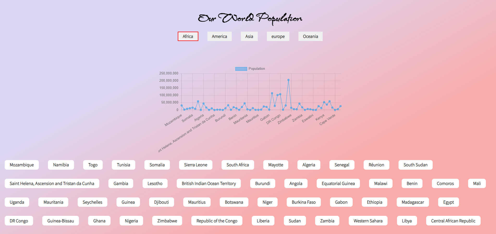
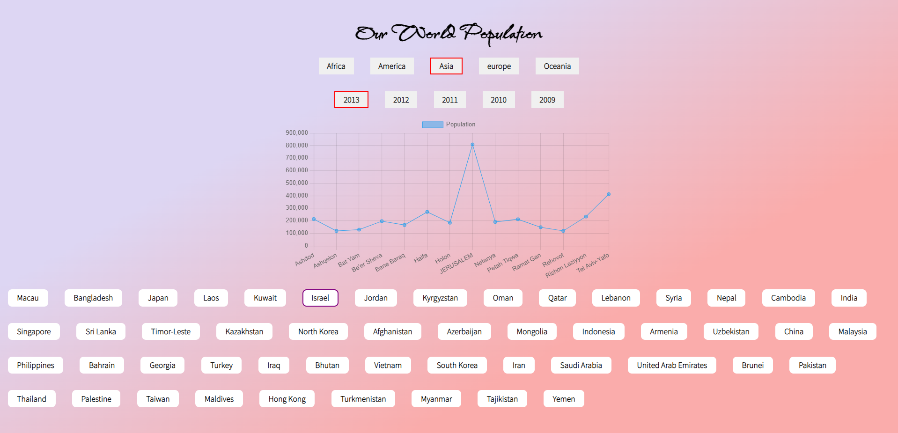

# World-Population

<h1>About The Project</h1>
<h3>It was my first project whit API. includdes vanilla JS with dom, HTML & CSS </h3>

difficulties:

<ul>
<li>to access to the API of the cities</li>
<li>to reset the canvas in every click to get new graph</li>
<li>to deal with countries with no data.</li>
<li>when I had graph by years in the population of specific city it was hard because ant city has different data.</li>
</ul>

planning project:

a little bit from the project:

